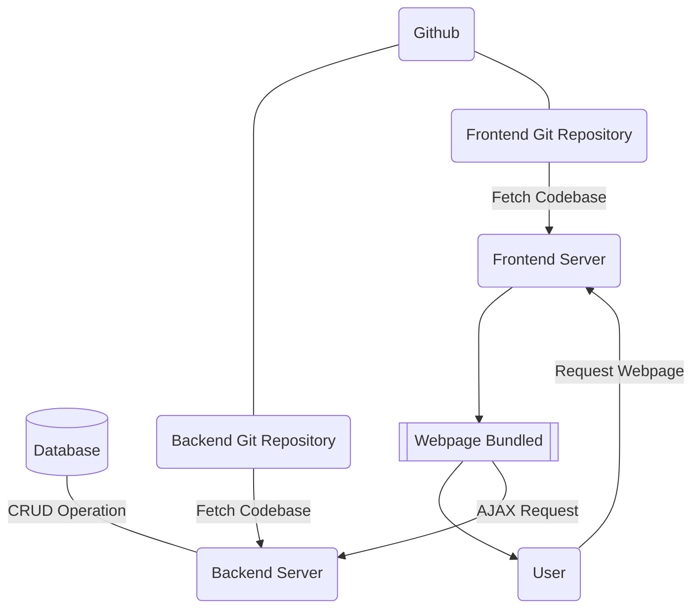

# Overview

```mermaid
flowchart
DB[(Database)] --- |CRUD Operation| S1(Backend Server)
S2(Frontend Server) ---> WP[[Webpage Bundled]]
WP[[Webpage Bundled]] -->  USR(User)
WP[[Webpage Bundled]] --> |AJAX Request| S1(Backend Server)
USR(User) --> |Request Webpage| S2(Frontend Server)
REPO1(Backend Git Repository) --> |Fetch Codebase| S1(Backend Server)
REPO2(Frontend Git Repository) --> |Fetch Codebase| S2(Frontend Server)
GH(Github) --- REPO1(Backend Git Repository)
GH(Github) --- REPO2(Frontend Git Repository)
```